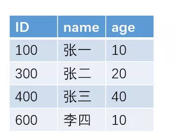
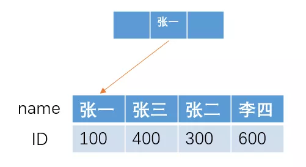
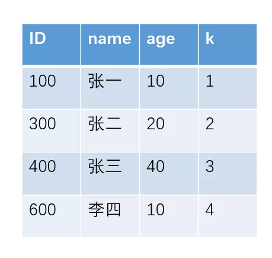
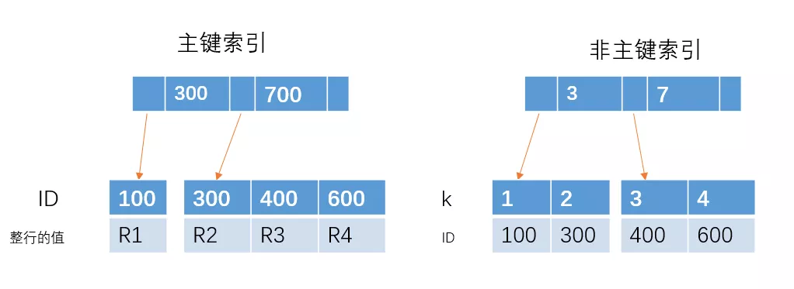
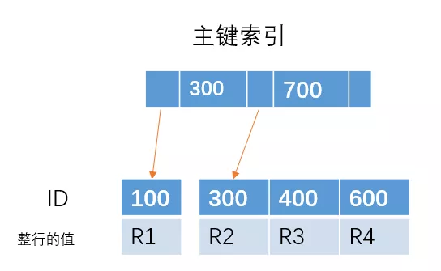
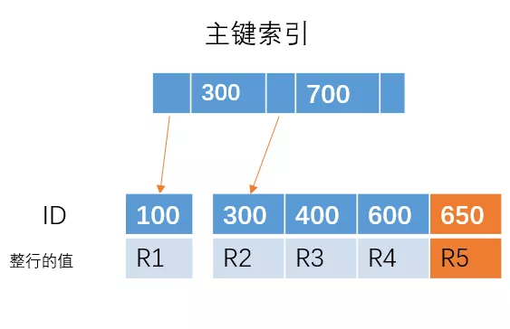

# MYSQL索引相关

>作者: 帅地

>来自: [MYSQL索引相关](https://mp.weixin.qq.com/s/RemJcqPIvLArmfWIhoaZ1g)


## 1.什么是最左前缀原则？

>以下回答全部是基于MySQL的InnoDB引擎

例如下面这张表

<center></center>

如果我们按照 name 字段来建立索引的话，采用B+树的结构，大概的索引结构如下

<center></center>

如果我们要进行模糊查找，查找name 以“张"开头的所有人的ID，即 sql 语句为
```
select ID from table where name like '张%'
```
由于在B+树结构的索引中，索引项是按照索引定义里面出现的字段顺序排序的，索引在查找的时候，可以快速定位到 ID 为 100的张一，然后**直接向右遍历**所有**张**开头的人，直到条件不满足为止。

也就是说，我们找到第一个满足条件的人之后，直接向右遍历就可以了，由于**索引是有序的**，所有满足条件的人都会聚集在一起。

而这种定位到最左边，然后向右遍历寻找，就是我们所说的**最左前缀原则**。

## 2.为什么用B+树索引

1、哈希表是把**索引字段映射成对应的哈希码**然后再存放在对应的位置，这样的话，如果我们要进行模糊查找的话，显然哈希表这种结构是不支持的，只能遍历这个表。而B+树则可以通过**最左前缀原则**快速找到对应的数据。

2、如果我们要进行范围查找，例如查找ID为100 ~ 400的人，哈希表同样不支持，只能遍历全表。

3、索引字段通过哈希映射成哈希码，如果很多字段都刚好映射到相同值的哈希码的话，那么形成的索引结构将会是一条很长的**链表**，这样的话，查找的时间就会大大增加。

## 3. 主键索引和非主键索引有什么区别？

例如对于下面这个表(其实就是上面的表中增加了一个k字段),且ID是主键。

<center></center>

主键索引和非主键索引的示意图如下：

<center></center>

其中R代表一整行的值。

从图中不难看出，主键索引和非主键索引的区别是：非主键索引的叶子节点存放的是**主键的值**，而主键索引的叶子节点存放的是**整行数据**，其中非主键索引也被称为**二级索引**，而主键索引也被称为**聚簇索引**。

根据这两种结构我们来进行下查询，看看他们在查询上有什么区别。

1、如果查询语句是 select * from table where ID = 100,即主键查询的方式，则只需要搜索 ID 这棵 B+树。

2、如果查询语句是 select * from table where k = 1，即非主键的查询方式，则**先搜索k索引树**，得到ID=100,**再到ID索引树搜索一次**，这个过程也被称为**回表**。

## 4. 为什么建议使用主键自增的索引？

对于这颗主键索引的树

<center></center>

如果我们插入 ID = 650 的一行数据，那么直接在最右边插入就可以了

<center></center>

但是如果插入的是 ID = 350 的一行数据，由于 **B+ 树是有序的**，那么需要将下面的叶子节点进行移动，**腾出位置**来插入 ID = 350 的数据，这样就会比较消耗时间，如果刚好 R4 所在的数据页已经满了，需要进行页分裂操作，这样会更加糟糕。

但是，如果我们的主键是自增的，每次插入的 ID 都会比前面的大，那么我们每次**只需要在后面插入**就行， **不需要移动位置、分裂等操作**，这样可以提高性能。也就是为什么建议使用主键自增的索引。
